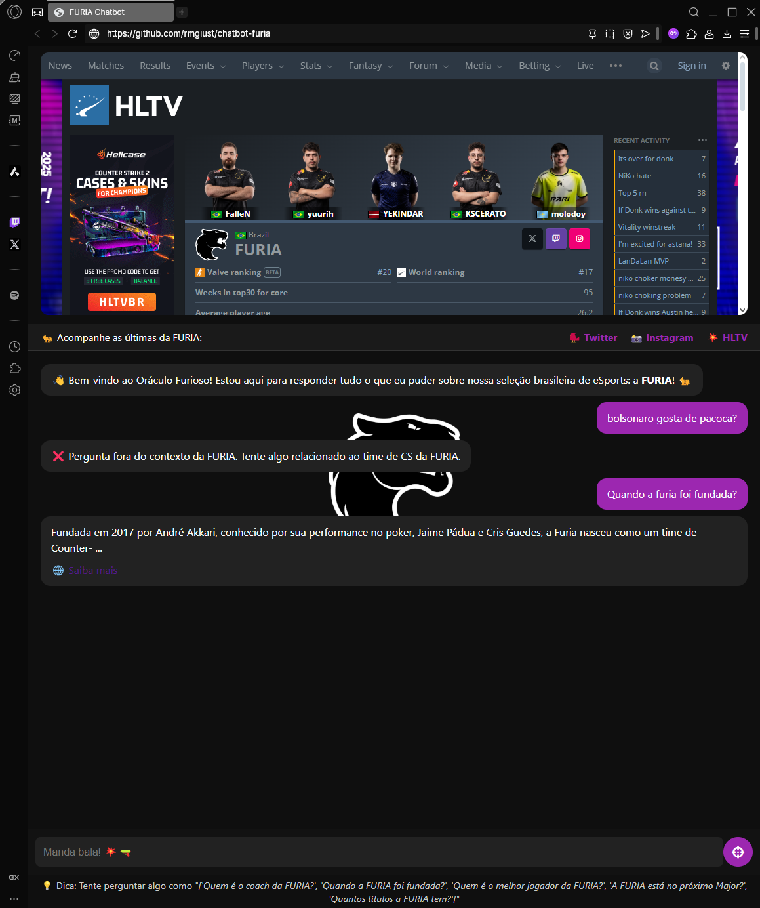

# 🐆 Chatbot da FURIA (Flask)

Um chatbot web interativo que responde perguntas exclusivamente sobre o time de CS da FURIA, utilizando Flask + SerpAPI + RapidFuzz.

> Desafio técnico para a vaga de Estágio em Engenharia de Software na organização FURIA Esports.

---

## 📸 Preview



---

## 🔥 Funcionalidades

✅ Responde perguntas **somente** sobre o time de CS da FURIA  
✅ Busca respostas em tempo real via **SerpAPI**  
✅ Interface web moderna (HTML + CSS)  
✅ Filtro inteligente de temas usando **similaridade de texto (RapidFuzz)**  
✅ Delay simulado de resposta para UX  
✅ Sugestão dinâmica de perguntas  
✅ Visual adaptado com branding da FURIA (logo, cores, links)

---

## 🧠 Tecnologias Utilizadas

- Python 3.11+
- Flask
- SerpAPI
- RapidFuzz
- HTML5 / CSS3
- Render (deploy gratuito)

---

## 🚀 Como Rodar Localmente

```bash
# Clone o projeto
git clone https://github.com/rmgiust/chatbot-furia.git
cd chatbot-furia

# Crie e ative o ambiente virtual
python -m venv venv
venv\Scripts\activate  # Windows
# ou
source venv/bin/activate  # Mac/Linux

# Instale as dependências
pip install -r requirements.txt

# Crie um arquivo .env com sua chave SerpAPI
echo SERPAPI_KEY=sua_chave_aqui > .env

# Rode a aplicação
python main.py


---

## 🙋 Autor

Feito com 💻 e muita cafeína por **[Roni Giust](https://github.com/rmgiust)**